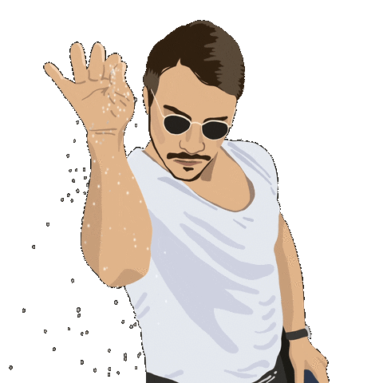
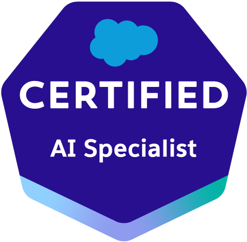

<h1 align="center">Hi, I'm Cristian Soria!</h1>

  

## About Me :wave:

Hi everyone! 😄 My name is Cristian, and I'm a web developer specializing in Salesforce. I enjoy creating applications that solve real-world problems or automate repetitive tasks to meet people's needs. Always ready to contribute to projects and collaborate with others to continue learning and improving constantly. Feel free to reach out!

## My certifications 🌟 
 

## Technologies I'm Learning :books: 

#### Front-end:

#### Back-end:

## My proyects :tada: </em>

 

### [Live Site](https://compu-henry.netlify.app)

# E-commerce Compu Henry

Página web para venta de insumos informáticos con todas las funcionalidades de un e-commerce.
Trabajo en equipo de 7 personas utilizando metodologías ágiles
(SCRUM). Un mes de duración total, con springs semanales
presentados a un Product Owner.

## Objetivos del Proyecto

- Construir una App JavaScript desde cero.
- Afirmar y conectar los conceptos aprendidos en la carrera.
- Aprender mejores prácticas.
- Aprender y practicar el workflow de GIT.
- Utilizar Metodologías Ágiles.
- Trabajar en equipo.
- Usar y practicar testing.

 

### [Live Site](https://social-media-mern-app.netlify.app/)

# Memories Social Media MERN app

Red social que permite a los usuarios compartir posteos de actividades/recuerdos.  
Base de datos no relacional en MongoDB, posibilidad de login con google, detalles de post con posts recomendados, busqueda por tag o título, contador de likes, ...
